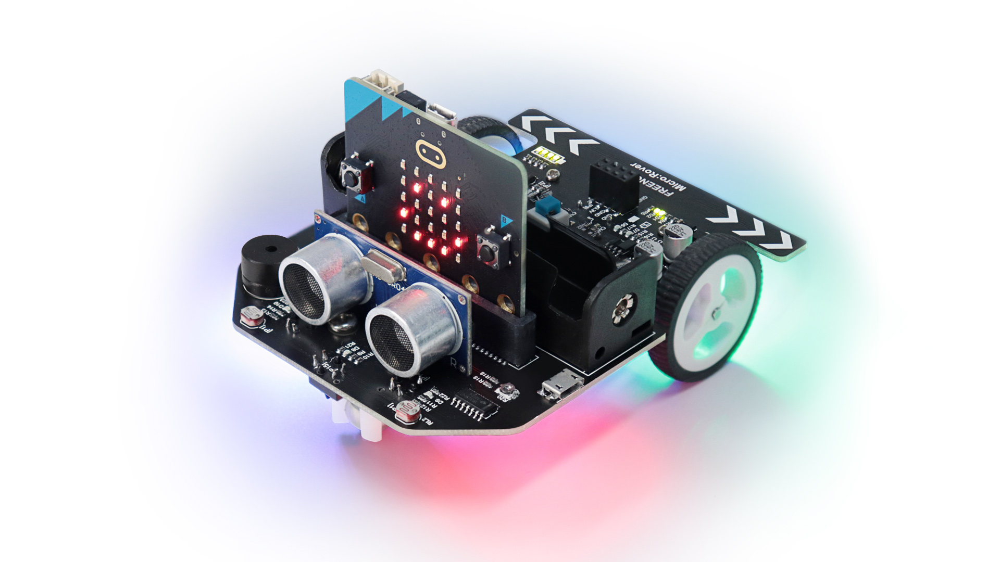

# ACM Robot Building Event Guide

Welcome to the ACM Robot Building Workshop! In this event, you'll learn how to build and program the **Freenove Micro:Rover**, a fun and interactive micro:bit-powered robot. This guide will help you get started with assembling the robot, connecting your micro:bit, and programming it using Microsoft's [MakeCode Editor](https://makecode.microbit.org/).

---

## 🚗 What You’ll Need

- Freenove Micro:Rover Kit
- BBC micro:bit board (v1 or v2)
- 18650 battery (not included in the kit) (You can still use the robot without this but you need to keep the micro USB cable plugged in)
- Micro USB cable (Used for charging and programming the robot)
- A computer (Windows/Mac/Linux/Chromebook) with a USB port

---

## 📦 Download Required Files

Download the complete project files and examples from Freenove’s GitHub:
- [Download ZIP](https://github.com/Freenove/Freenove_Micro_Rover/archive/refs/heads/master.zip)

Unzip it to a location on your computer. The folder will contain tutorials, `.hex` files for direct upload, and other resources.

---

## 🛠️ Assembly Instructions

1. **Insert micro:bit into the Rover**.
2. **Install the ultrasonic ranging module (looks like eyes)**.
3. **Insert and charge the 18650 battery**.
4. **Turn on the power switch on the Rover**.

For detailed visuals, refer to the `Tutorial.pdf` found at their [GitHub Repo](https://github.com/Freenove/Freenove_Micro_Rover) or visit [Freenove.com](http://www.freenove.com/).

---

## 💻 Programming with MakeCode

1. Go to [https://makecode.microbit.org](https://makecode.microbit.org)
2. Click `New Project`.
3. To use the robot’s sensors and motors, add the Rover extension:
   - Click the + icon called Extensions
   - Search rover in the search bar
   - Click on the `Makecode-Extension-Rover` extension to install.

4. You’ll now see blocks to control the LEDs, Motors, and Sensors.

---

## 🔁 Uploading Code to micro:bit

- **Browser Upload:**
  - After coding, click `Download` to get a `.hex` file.
  - Drag and drop it onto the MICROBIT USB drive.
  
- **Quick Upload (Chrome + WebUSB):**
  - Use the gear icon ⚙️ → `Connect Device` and follow the built in guide

Make sure to only upload one program at a time—new uploads overwrite old ones.

---

## 🔄 Example Projects to Try

- **Flashing Lights**
- **Play a Melody**
- **Obstacle Avoidance**
- **Light Tracking**
- **Line Following**

All sample `.hex` files are available in the `Projects` folder from the downloaded ZIP file.

---

## ⏏️ Submittion

After completing your project, please submit your `.hex` file to the official ACM Event GitHub repository.

### Steps:

1. **Fork** the current repository.
2. **Clone** your fork locally
3. **Push** Changes to your cloned repo at the `Submissions` directory using `file_name_Your_Name.hex` for the filename.
4. **Open** pull request from your fork to the main repository

Need help? Ask a mentor at the event! 

## 📱 Optional: Remote Control via App

You can also control the Rover using Freenove's mobile app:
- Android: [Google Play](https://play.google.com/store/search?q=freenove)
- iOS: Search "Freenove" in the App Store

---

## 🧠 Support and Resources

- Official Site: [freenove.com](http://www.freenove.com/)
- Documentation & Help: [support@freenove.com](mailto:support@freenove.com)

---

Enjoy building and programming your robot! 🤖🎉
